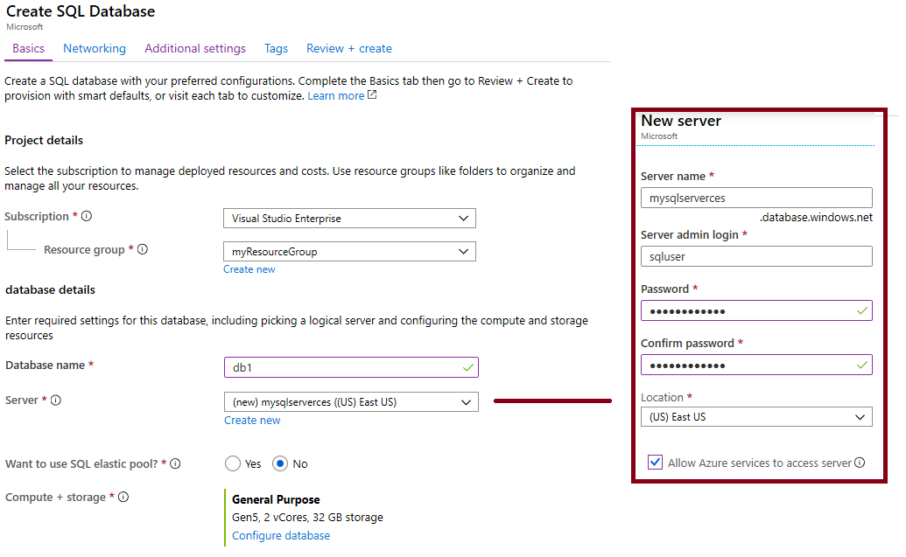

---
wts:
    title: '05 - Create a SQL database'
    module: 'Module 02 - Core Azure Services'
---

# 05 - Create a SQL database

In this walkthrough, we will create a SQL database in Azure and then query the data in that database.

# Task 1: Create the database

In this task, we will create a SQL database based on the AdventureWorksLT sample database. 

1. Sign in to the Azure portal at <a href="https://portal.azure.com" target="_blank"><span style="color: #0066cc;" color="#0066cc">https://portal.azure.com</span></a>

2. From the **All services** blade, search for and select **SQL databases**, and then click **+ Add**. 

3. On the **Basics** tab, fill in this information.  

    | Setting | Value | 
    | --- | --- |
    | Subscription | **Choose your subscription** |
    | Resource group | **myRGDb** (create new) |
    | Database name| **db1** | 
    | | |

3. Next to the **Server** drop down list, click **Create new** and enter this information (replace **xxxx** in the name of the storage account with letters and digits such that the name is globally unique). Click **OK** when finished.

    | Setting | Value | 
    | --- | --- |
    | Server name | **sqlserverxxxx** (must be unique) | 
    | Server admin login | **sqluser** |
    | Password | **Pa$$w0rd1234** |
    | Location | **(US) East US** |
    | Allow Azure services to access server | **Check the box** |
    | | |

   

4. Move to the **Additional settings** tab. We will be using the AdventureWorksLT sample database.

    | Setting | Value | 
    | --- | --- |
    | Use existing data | **Sample** | 
    | | |

5. Click **Review + create** and then click **Create** to deploy and provision the resource group, server, and database. It can take approx. 2 to 5 minutes to deploy.

6. Monitor your deployment. 

# Task 2: Test the database.

In this task, we will configure the SQL server and run a SQL query. 

1. From the **All services** blade, search and select **SQL databases** and ensure your new database was created. You may need to **Refresh** the page.

    

2. Click the **db1** entry representing the SQL database you created, and then click **Query editor (preview)**.

3. Login as **sqluser** with the password **Pa$$w0rd1234**.

4. You will not be able to login. Read the error closely and make note of the IP address that needs to be allowed through the firewall. 

    

5. From the **All services** blade, search for **SQL servers**, and select your SQL server. 

    

6. From the SQL server **Overview** blade, click **Show firewall settings**.

7. Click **Add client IP** (top menu bar) to add the IP address referenced in the error. Be sure to **Save** your changes. 

    

8. Return to your SQL database and the Query Editor (Preview) login page. Try to login again as **sqluser** with the password **Pa$$w0rd1234**. This time you should succeed. Note that it may take a couple of minutes for the new firewall rule to be deployed. 

9. Once you log in successfully the query pane appears, enter the following query into the editor pane.

    ```SQL
    SELECT TOP 20 pc.Name as CategoryName, p.name as ProductName
    FROM SalesLT.ProductCategory pc
    JOIN SalesLT.Product p
    ON pc.productcategoryid = p.productcategoryid;
    ```

    

10. Click **Run**, and then review the query results in the **Results** pane. The query should run successfully.

    

Congratulations! You have created a SQL database in Azure and successfully queried the data in that database.

**Note**: To avoid additional costs, you can remove this resource group. Search for resource groups, click your resource group, and then click **Delete resource group**. Verify the name of the resource group and then click **Delete**. Monitor the **Notifications** to see how the delete is proceeding.