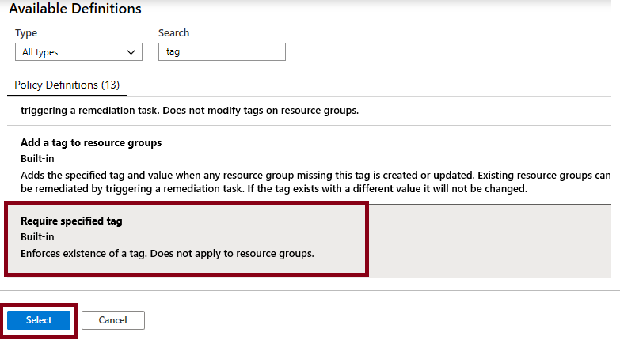
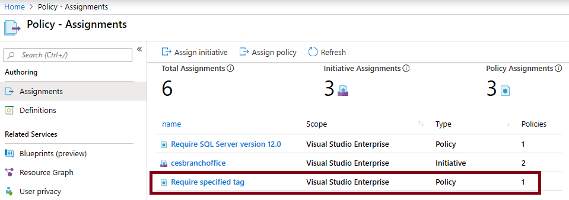
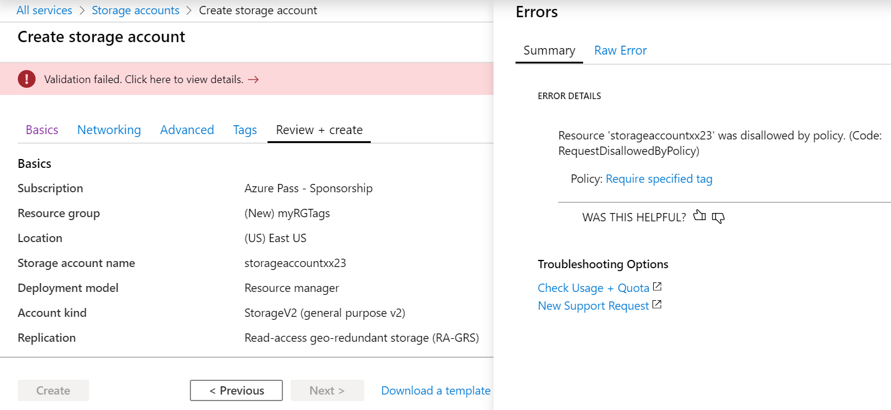

---
wts:
    title: '17 - Implement resource tagging'
    module: 'Module 03 - Security, Privacy, Compliance and Trust'
---
# 17 - Implement resource tagging

In this walkthrough, we will create a policy assignment that requires tagging, created a storage account and test the tagging, view resources with a specified tag, and remove the tagging policy.

# Task 1: Create a Policy assignment

In this task, we will configure the **Require specified tag** policy and assign it to our subscription. 

1. Sign in to the [Azure portal](https://portal.azure.com).

2. From the **All services** blade, search for and select **Policy**.

3. Scroll down to the **Authoring** section, click **Assignments**, and then click **Assign Policy** from the top of the  page.

4. Notice the **Scope** for our policy will be subscription wide. 

5. Select the **Policy definition** ellipsis button (end of the textbox on the right). **Search** for policy definitions including the value **tag**, in the result set, click on the  **Require specified tag** definition, then click **Select**.

   

6. On the **Assign policy** blade, in the **Parameters** tab, type in **Company** for the tag name. Cick **Review + create**, and then **Create**.

    **Note:** This is a simple example to demonstrate tagging. 

    

7. The **Require specified tag** policy assignment is now in place. When a resource is created, it must include a tag with the Company key.

   

# Task 2: Create a storage account to test the required tagging

In this task, we will create storage accounts to test the required tagging. 

1. In the Azure Portal, from the **All services** blade, search for and select **Storage accounts**, and then click **+ Add**.

2. On the **Basics** tab of the **Create storage account** blade, fill in the following information (replace **xxxx** in the name of the storage account with letters and digits such that the name is globally unique). Leave the defaults for everything else.

    | Setting | Value | 
    | --- | --- |
    | Subscription | **Use your subscription** |
    | Resource group | **myRGTags** (new) |
    | Storage account name | **storageaccountxxxx** |
    | Location | **(US) East US** |
    | | |

3. Click **Review + create**. 

**Note:** We are testing to see what happens when the tag is not supplied. 

4. You will receive a Validation failed message. Click the **Click here to view details** message. On the **Errors** blade, on the **Summary** tab note the error message stating that resource was disallowed by Policy.

    **Note:** If you view the Raw Error tab you will see the specific tag name that is required. 

    

5. Close the **Error** pane and click **Previous** (bottom of the screen). Provide the tagging information. 

    | Setting | Value | 
    | --- | --- |
    | Tag name | **Company** (may not be in the drop-down list) |
    | Tag value | **Contoso** |
    | | |

6. Click **Review + create** and verify that the validation was successful. Click **Create** to deploy the storage account. 

# Task 3: View all resources with a specific tag

1. In the Azure Portal, from the **All services** blade, search for and select **Tags**.

2. Note all tags and their values. Click the **Company : Contoso** key/value pair. This will display a blade showing the newly created storage account, as long as you included the tag during its deployment. 

   

3. In the Portal, display the **All resources** blade.

4. Click **Add filter** and add the **Company** tag key as the filter category. With the filter applied, only your storage account will be listed.

    

# Task 4: Delete the policy assignment

In this task, we will remove the **Require specific tag** policy so it does not affect our future work. 

1. In the portal, from the **All services** blade, search for and select **Policy**.

2. Click the **Require specified tag** policy entry.

3. Click **Delete Assignment** in the top menu.

4. Confirm you wish to delete the policy assignment in the **Delete assignment** dialogue by clicking **Yes**

5. If you have time, create another resource without a tag to ensure the policy is no longer in effect.

In this walkthrough, we created a policy assignment that required tagging, created a storage account and tested the tagging, viewed resources with a specified tag, and removed the tagging policy.

**Note**: To avoid additional costs, you can remove this resource group. Search for resource groups, click your resource group, and then click **Delete resource group**. Verify the name of the resource group and then click **Delete**. Monitor the **Notifications** to see how the delete is proceeding.